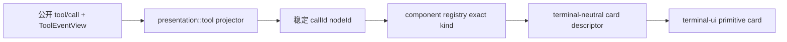

# TUI 调用卡片渲染详细设计

状态：`design`（已获 UI 方向确认，待按实现计划进入 Phase 1）

## 目标

把 Host 提供的公开 Tool call/result 事实渲染为可扫描、可折叠、可追踪的终端卡片：

- 调用中能看见工具名、生命周期和必要的公开摘要；
- 调用完成后，同一张卡片原位收敛为结果；
- 失败明确显示失败状态和错误，不把失败伪装成成功；
- 终端层不读取 raw SessionEvent、transport、metadata、provider 或控制状态；
- specialized card 缺少 renderer 时显式失败，不猜测、不 fallback。

## 唯一主线



唯一 owner：

| 阶段 | owner | 责任 |
|---|---|---|
| 配对与生命周期 | `presentation` | 以公开 `callId` 合并 call/result，维护 `pending/running/completed/failed` |
| 卡片类型选择 | `presentation` + Host `ToolEventView` | 只接受显式 `generic/terminal/read/search/diff/workflow/skill/error` intent |
| 卡片视觉描述 | `terminal-ui` renderer registry | 将 typed node 转为 `tui.element.v1`，不调用 Host |
| 终端布局 | `terminal-ui` | 统一宽度、折叠、换行、颜色和 primitive realization |

## 卡片数据合同

展示允许字段仅来自公开 `TuiToolNodeValue`：

- `name`
- `arguments`（默认折叠；卡片摘要不得直接倾倒完整参数）
- `status`
- `result`
- `error`
- `callRenderIntent` / `resultRenderIntent` 中的公开展示字段

禁止进入卡片 payload 或展示：`metadata`、`event`、`seq`、`endpoint`、`rpc`、`provider`、`model`、`health`、`route`、`retry`、`continuation` 及任意 raw frame。

## 状态与视觉

| 状态 | 标题 | 内容 | Scheme A |
|---|---|---|---|
| `pending` | 工具名 | 调用已排队，可显示参数摘要 | white + dim dot |
| `running` | 工具名 | 显示进行中标记和已知公开摘要 | white + bold dot |
| `completed` | 工具名 | 显示结果摘要，完整内容默认折叠 | green dot + white text |
| `failed` | 工具名 | 显示错误摘要与可读原因 | red dot + white text |

工具卡片采用已确认的局部语义色：成功点为绿色，失败点为红色；正文默认白色。卡片的 `Ran` 标签为白色，文件名为蓝色，命令本身和 `--参数` 为红色，其余正文为白色。reasoning 使用浅灰。该工具卡片色彩规则是对通用 Scheme A 约束的明确局部扩展，不能外溢到其他 UI 状态。

不显示 `completed`、`failed` 等状态前后缀；状态只由前置点表达。不使用 emoji 充当图标，使用受控的 terminal primitive marker。卡片使用 `black/gray/dark-gray` 做区域层次。

## 交互与布局

1. 卡片根节点使用稳定 `nodeId`，call/result 更新不改变位置。
2. 默认只展示一行标题和一行摘要；长参数、长结果按终端宽度换行并可折叠。
3. 折叠状态属于 terminal-ui 交互状态，不写回业务 node value。
4. 多行输出保持原始公开文本语义，不截断真实结果；仅在视觉层折叠/分页。
5. 卡片与 user/assistant transcript cell 有明确上下间距；不把工具结果伪装成 assistant 文本。
6. 每轮 transcript 之间插入一条 terminal-only 横线分隔；横线不进入业务 payload，不在同一轮的 assistant/tool 节点之间重复插入。
7. renderer 返回 `null` 仅用于明确注册的非表面节点（如内部 context），工具卡片不能静默返回空结果。

### 已确认的卡片文字规则

read：直接显示文件名，不重复显示 `read` 或 `Read file`：

```text
● app-shell.ts
```

shell：使用白色 `Ran` 标签，不显示 `shell`、`$` 或 `completed`；命令本身和 `--参数` 使用红色：

```text
● Ran pnpm test --watch
```

文件编辑：文件名使用蓝色，diff 删除红色、增加绿色、上下最多各一行真实白色 context，行号位于左侧：

```text
● app-shell.ts
  12 │ return render()
- 13 │ const color = "yellow"
+ 13 │ const color = "white"
  14 │ return flush()
```

卡片前后保留布局空白；横线只用于轮次边界。

## 分阶段实现

### Phase 1：通用卡片基线

- 完成 `tool.generic` 的标题、状态、摘要、折叠参数/结果；
- 建立 `pending → running → completed/failed` 正反生命周期测试；
- 建立禁止控制字段泄露的闭合合同测试；
- 更新 terminal fixture 与静态 simulator fixture。

### Phase 2：专用卡片

- `tool.terminal`：命令标题、cwd、exit code、stdout/stderr 分区；
- `tool.read/search`：路径/查询摘要与结果区；
- `tool.diff`：文件、增删统计、折叠 diff；
- `tool.workflow/skill`：公开阶段与结果摘要；
- `tool.error`：错误原因与失败边界。

### Phase 3：执行状态与交互窗口

- `execution-status-plugin` 独立投影输入框上方一行；
- 显示 running、计时和 `Esc interrupt`；
- 只消费 typed execution projection，不直接调用 Session；
- `interactive-window-plugin` 承载 approval、ask、models、provider、permissions；
- slash command plugin 只解析/分类命令，并把交互命令交给窗口插件。

### Phase 4：真实样本与收口

- 每种 card intent 使用公开 Host `ToolEventView` 样本重放；
- PTY 验证宽窄终端、流式更新、折叠和失败收口；
- 通过 design/runtime-boundary/build/clean-install 后再启动 AGY Review。

## 验收门禁

- 正向：每种卡片能从 call 渲染到 result，nodeId 稳定，结果完整可读；
- 反向：result 无 call、callId 不匹配、缺失专用 renderer、非法控制字段、失败被投影为成功均 fail-fast；
- `test:design`、`typecheck`、`check:runtime-boundaries`、受影响模块测试/build、`build:runtime`、`check:clean-install`、真实 PTY 样本全部通过；
- 未完成上述门禁前，设计状态保持 `design`，不得声称已实现。
